<div align="center">


# Codex Power Mode

### A tiny native HUD for people who think “loading…” is not a personality

Codex is doing real work. It deserves better than a spinner.<br>
Watch it understand, inspect, edit, verify, recover, and finish—then add Energy, Combo, neon sparks, or a suspiciously elegant penguin.

[English](README.md) · [简体中文](README.zh-CN.md)

[](https://github.com/zytsyj/codex-power-mode/actions/workflows/ci.yml)
[](https://github.com/zytsyj/codex-power-mode/releases)
[](LICENSE)
[](docs/COMPATIBILITY.md)
[](docs/DEPENDENCIES.md)

[Why it moved to Codex](#when-vs-code-stopped-being-the-main-stage) · [Visual tour](#the-whole-idea-in-four-frames) · [See it move](#see-it-move) · [Quick start](#quick-start) · [Privacy](#local-and-private-by-design) · [Documentation](#documentation)

</div>

> [!NOTE]
> Power Mode `0.9.2` is an **open-source public beta**. Source code, documentation, and project-authored media use MIT. Four legacy meme image sets are distributed separately and are not covered by MIT; see [Third-party notices](THIRD_PARTY_NOTICES.md).

> [!WARNING]
> **A small vibe-coding disclaimer:** this is coding candy, not mission-critical instrumentation. It may occasionally miss a Combo, read a state late, twitch, lose the screen, or go mysteriously quiet exactly when you want the fireworks. Power Mode is here to make working with Codex more visible and more fun; it does not know the model's thoughts or the real percentage of work completed. If the HUD has a bad day, Codex should keep working normally. Bugs, rough edges, and delightfully strange reports are welcome.

## When VS Code stopped being the main stage

I used to spend the day inside VS Code. I read the code, I wrote the code, and Power Mode made every keystroke explode just enough to make the work feel alive. It was silly, immediate, and strangely satisfying—because I was the one doing the work, with my hands on the keyboard.

Then Codex quietly replaced VS Code as the place where much of my coding happens. Now I describe what I want, and Codex reads the repository, finds the right files, makes the change, and runs the tests. I still care about the code, but I no longer spend the whole time staring at every line. The editor slipped into the background. The one doing most of the typing was no longer me.

That made the old Power Mode loop feel oddly stranded. If the work had moved from VS Code to Codex—and from my fingers to an agent—then Power Mode had to move too.

The first prototype simply turned Codex patches into fake high-speed typing. It had sparks and Combo, but it was pretending the old workflow had not changed. So I stopped animating the keyboard and started animating the worker: understanding, searching, editing, testing, waiting, failing, recovering, and finishing. You may not be watching the code anymore, but you can still feel the work moving.

But the human did not become a spectator. When you finish typing a request, the Typing Combo is pulled into the orb as a deliberately high-weight Energy charge. At the default setting, a `40+` input Combo injects `65` Energy—roughly the weight of three to six routine Codex state steps. Codex may perform dozens of actions, but your instruction decides which direction all of them should take, so it deserves more weight than any one mechanical step. Power Mode never reads what you typed; it gives weight to the fact that you shaped and submitted the intent.

That is really all this project is: **Power Mode for the moment when the coder became the director and Codex became the one at the controls.** Classic mode keeps the old keystroke fireworks around for fun. The orb is what came next.

## Built with Codex, bugs included

Most of this project was vibe-coded with AI—mostly Codex. I brought the idea, the taste, the final decisions, and many rounds of “still not quite right.” Codex wrote a large part of the implementation, refactors, tests, and documentation. So yes: this is a HUD for watching Codex work, largely built by Codex itself. The recursion is part of the fun.

There are automated tests, deterministic visual checks, privacy boundaries, and CI. There may still be bugs. A Codex or macOS update may surprise it; an animation may behave strangely in a corner case; a permission flow may decide today is the day to become performance art. This is an open-source public beta, not critical infrastructure or a trustworthy progress meter.

Treat it like the old Power Mode: something made because coding is allowed to be fun. If it breaks, please open an issue with a reproducible example—and feel free to let Codex help fix the thing Codex helped write.

## The whole idea in four frames

The GIFs below show the motion, but these real captured frames explain the system at a glance.

<p align="center">
  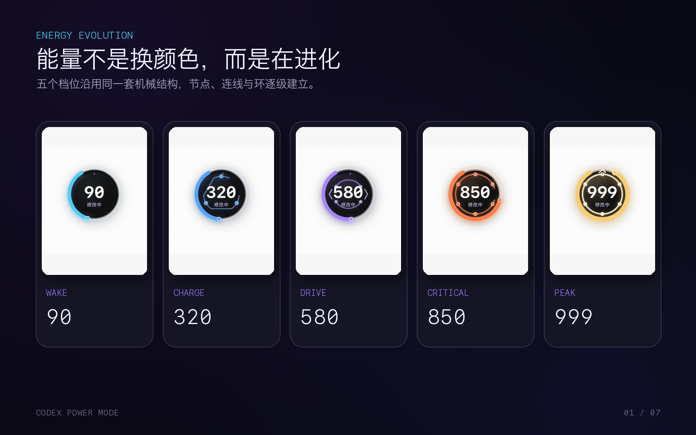
</p>

Energy does not merely change color. One connected mechanism gains nodes, links, direction, locks, and finally a synchronized crown as useful work accumulates.

<p align="center">
  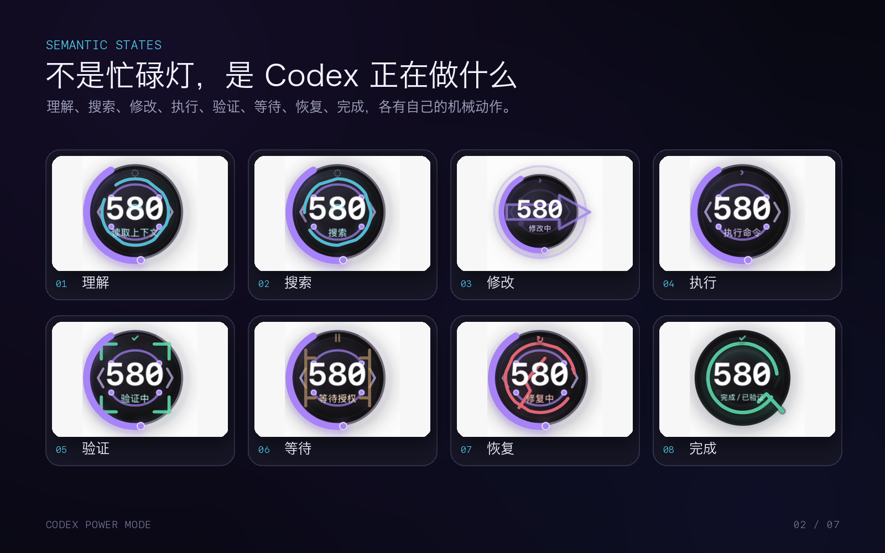
</p>

The HUD gives Codex a readable body language: understand, search, edit, execute, verify, wait, recover, and complete. The large editing arrow is a transient action—not permanent decoration.

<table>
  <tr>
    <th width="50%">Two Combos, then injection</th>
    <th width="50%">Four honest endings</th>
  </tr>
  <tr>
    <td>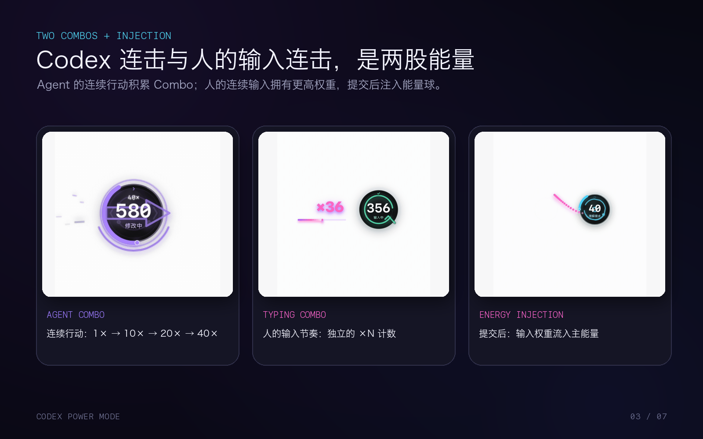</td>
    <td>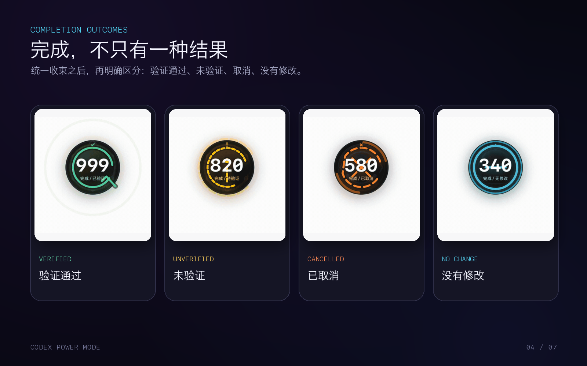</td>
  </tr>
  <tr>
    <td>Codex builds Agent Combo. Your input builds a separate Typing Combo, then visibly streams into the orb as a higher-weight Energy charge.</td>
    <td>Verified work celebrates. Unverified, cancelled, and no-change turns each close differently instead of borrowing the same victory animation.</td>
  </tr>
</table>

## See it move

These are real screen recordings from Codex desktop—not design mockups. The capture build used an isolated local session and a blank task, so no prompt, source code, task name, or personal data appears in the media.

<table>
  <tr>
    <th width="50%">One machine, five Energy tiers</th>
    <th width="50%">The agent has a body language</th>
  </tr>
  <tr>
    <td align="center"></td>
    <td align="center">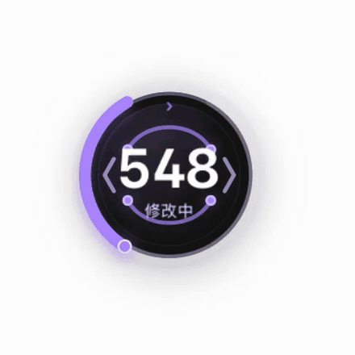</td>
  </tr>
  <tr>
    <td>Wake → Charge → Drive → Critical → Peak. The same nodes migrate and reconnect instead of stacking unrelated decorations.</td>
    <td>Understanding, searching, editing, executing, verifying, waiting, recovering, and completing each have their own restrained motion.</td>
  </tr>
</table>

### Two kinds of Combo, one shared sense of momentum

<table>
  <tr>
    <th width="33%">Agent Combo</th>
    <th width="33%">Typing Combo</th>
    <th width="33%">Human input becomes Energy</th>
  </tr>
  <tr>
    <td align="center"></td>
    <td align="center"></td>
    <td align="center"></td>
  </tr>
  <tr>
    <td>Codex actions build the outer arc through Ignite, Link, Accel, Heat, and Extreme—then visibly fracture when the chain expires.</td>
    <td>Your own input rhythm gets a separate counter. Power Mode tracks timing, never the characters you type.</td>
    <td>Submit pulls the human Combo into the orb as a deliberately high-weight charge, because the instruction steers everything that follows.</td>
  </tr>
</table>

<p align="center">
  <strong>And completion does not celebrate work that was never verified.</strong><br><br>
  
</p>

## Quick start

### Install as a Codex plugin

```bash
codex plugin marketplace add zytsyj/codex-power-mode
codex plugin add codex-power-mode@codex-power-mode
```

Then open a new Codex desktop task:

1. Review and trust the plugin Hooks when Codex asks.
2. The first trusted task starts one local service and one native HUD.
3. Choose **Use basic mode** or **Enable & grant access…** in the first-run guide.
4. Ask Codex to **check Power Mode status** whenever you want a health report.

Power Mode cannot click either operating-system security confirmation for you. It can explain the requirement, request Accessibility access, and open the exact macOS settings panel. Permission changes are detected without restarting the HUD.

<details>
<summary><strong>Run from a source checkout</strong></summary>

```bash
npm install
npm run check
npm run native
```

Useful development previews:

```bash
npm run showcase
npm run showcase:energy
npm run showcase:complete
npm run render:qa
```

</details>

## At a glance

| Native HUD | Semantic model | Feedback | Workflow |
| --- | --- | --- | --- |
| Focus, Arcade, and no-orb Classic | 6 agent states and 5 Energy tiers | Agent Combo, weighted Typing charge, 13 cursor styles | Focus, Global, and Mix activity sources |
| Direct drag and right-click settings | 4 honest completion outcomes | Low/Normal/High intensity | Auto-start, health checks, reset, and removal |
| Light/dark adaptation | Evidence-aware verification | Reduced Motion | English and Chinese controls |
| Click-through empty space | Smooth decay and return | Immediate effect replacement | Menu-bar settings |

## One visual system, not a loading spinner

Power Mode consumes trusted Codex lifecycle events and turns them into a stable visual grammar:

| State | Meaning | Motion language |
| --- | --- | --- |
| **Observe** | Understanding, reading, searching | Flow pulls inward |
| **Act** | Editing or executing useful work | Directional bus accelerates |
| **Verify** | Tests, builds, lint, type checks | Nodes lock in sequence |
| **Wait** | User approval is required | Mechanism latches and holds |
| **Recover** | A command or verification failed | Circuit reverses and repairs |
| **Complete** | The turn has ended | Rings close, stamp the outcome, then settle |

The center value and activity label remain a permanent no-draw zone. State animation never needs to overlap the number to communicate.

### Five Energy tiers

Energy ranges from `0` to `999`. Reaching `900` always enters the highest tier.

| Energy | Tier | Mechanical evolution |
| ---: | --- | --- |
| `0–199` | **Wake** | Base chassis comes online |
| `200–449` | **Charge** | Three nodes separate and orbit |
| `450–699` | **Drive** | A four-node directional bus engages |
| `700–899` | **Critical** | Six locks assemble around a stabilizer |
| `900–999` | **Peak** | The full mechanism phase-synchronizes under a white-gold crown |

Energy rewards useful state transitions and verification—not code volume. Large diffs raise risk instead of farming points. Human input has its own weight: submitting a recent Typing Combo injects a bounded `4–65` Energy without advancing Agent Combo.

## Three display modes

| Mode | Best for | What stays visible |
| --- | --- | --- |
| **Focus** | Long sessions and maximum readability | Semantic orb, Energy, optional Combo |
| **Arcade** | Stronger audiovisual-style feedback | The same model with richer impacts and particles |
| **Classic Power Mode** | Traditional typing feedback | No orb; only cursor effects and Typing Combo |

Classic mode leaves no invisible hit target when its feedback has finished.

## Completion that tells the truth

All tasks do not deserve the same celebration:

| Outcome | Condition | Visual result |
| --- | --- | --- |
| **Verified** | The latest edit is followed by successful evidence | Three reward rings |
| **Unverified** | Files changed without successful follow-up evidence | Caution gap remains open |
| **Cancelled** | Work stops while waiting or is explicitly cancelled | Split arcs retract |
| **No change** | The turn finishes without modifying code | Thin cyan ring settles quietly |

### Focus, Global, and Mix

| Activity source | Behavior |
| --- | --- |
| **Focus** | Keep the current conversation on the HUD |
| **Global** | Follow the latest Codex desktop conversation while preserving isolated state |
| **Mix** | Share one Energy and Combo pool across desktop conversations |

In Mix, each conversation gets a brief verified/unverified/cancelled/no-change stamp without resetting the shared pool. The last active conversation receives the full completion animation.

## Serious work, unserious cursor effects

Some days call for a quiet spark. Other days call for a liquid wormhole, a judgmental orange cat, or a possum silently supervising the pull request.

<table>
  <tr>
    <th width="50%">Eight geometric effects, captured up close</th>
    <th width="50%">Five ways to make the input box less respectable</th>
  </tr>
  <tr>
    <td>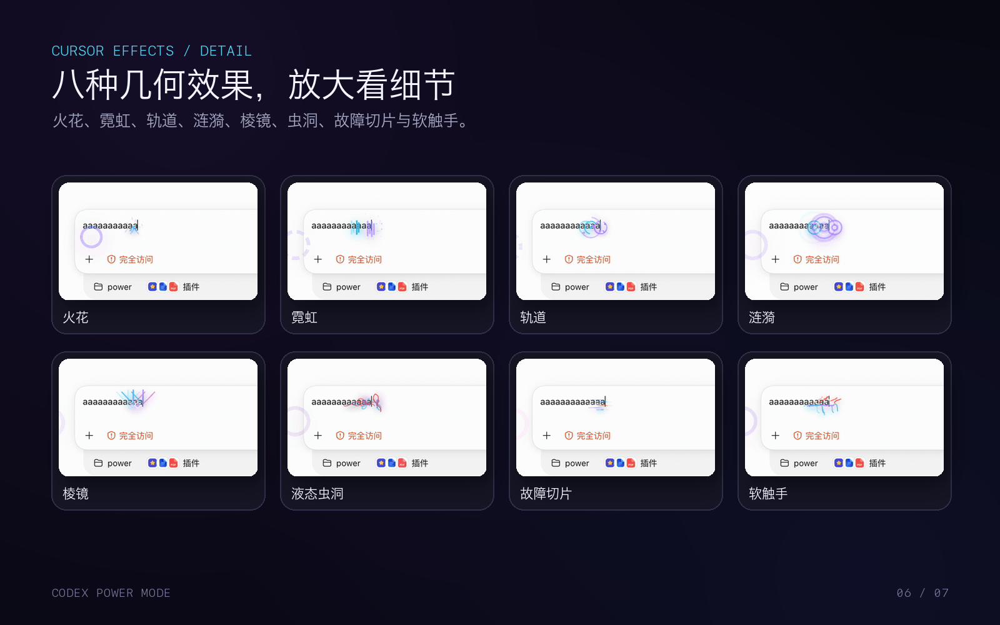</td>
    <td>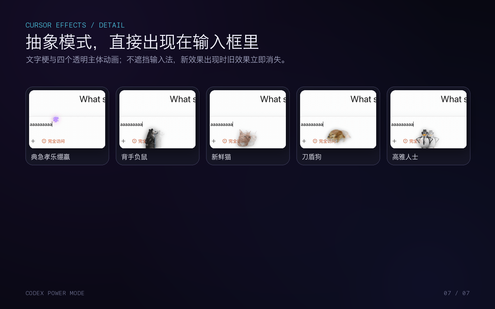</td>
  </tr>
</table>

And yes, they actually move:

<table>
  <tr>
    <th width="50%">Geometry gets weird</th>
    <th width="50%">The meme department has arrived</th>
  </tr>
  <tr>
    <td align="center">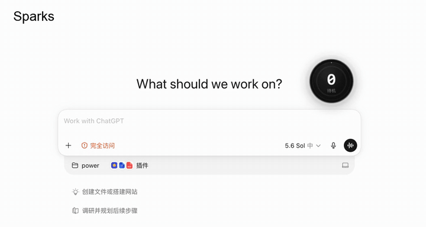</td>
    <td align="center">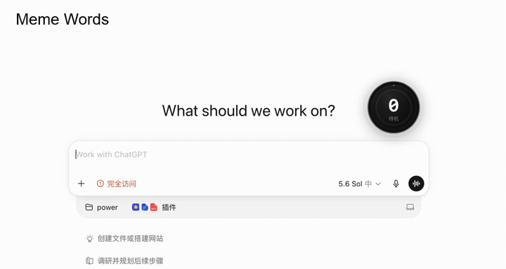</td>
  </tr>
  <tr>
    <td>Sparks · Neon · Orbit · Ripple · Prism · Liquid Wormhole · Glitch Slices · Soft Tentacles</td>
    <td>典急孝乐绷赢 · Hands-behind Possum · Fresh Cat · Knife-shield Dog · Elegant Person</td>
  </tr>
</table>

<details>
<summary><strong>Open the full 13-effect gallery</strong></summary>
<br>
<table>
  <tr>
    <th>Sparks</th>
    <th>Neon</th>
    <th>Orbit</th>
    <th>Ripple</th>
  </tr>
  <tr>
    <td></td>
    <td>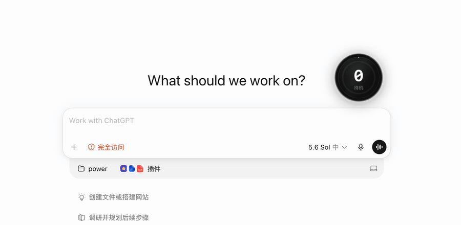</td>
    <td></td>
    <td></td>
  </tr>
  <tr>
    <th>Prism</th>
    <th>Liquid Wormhole</th>
    <th>Glitch Slices</th>
    <th>Soft Tentacles</th>
  </tr>
  <tr>
    <td></td>
    <td>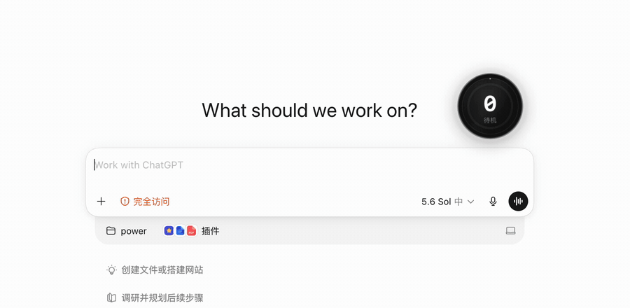</td>
    <td></td>
    <td></td>
  </tr>
  <tr>
    <th>典急孝乐绷赢</th>
    <th>Hands-behind Possum</th>
    <th>Fresh Cat</th>
    <th>Knife-shield Dog</th>
  </tr>
  <tr>
    <td>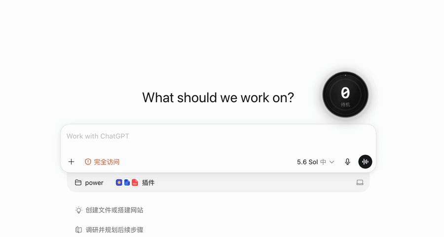</td>
    <td></td>
    <td>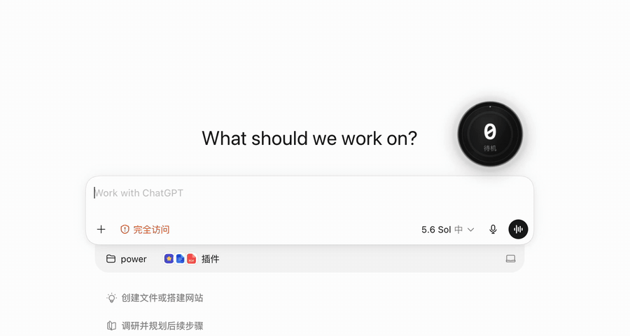</td>
    <td></td>
  </tr>
  <tr>
    <th>Elegant Person</th>
    <th colspan="3">New input dismisses the old effect immediately—no sticker traffic jam.</th>
  </tr>
  <tr>
    <td>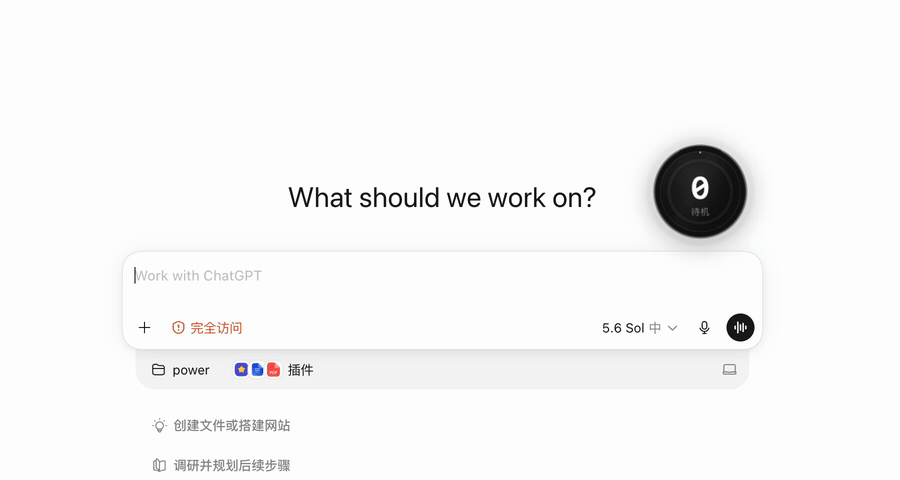</td>
    <td colspan="3">Every clip above is a real keyboard recording with the Typing Combo and orb visible beside the composer.</td>
  </tr>
</table>
</details>

Cursor effects are optional and independent from the large Typing Combo counter. Fast input never becomes a sticker traffic jam: every new effect dismisses the previous one immediately. The four legacy sticker families ship locally, so nothing is fetched at runtime; their separate rights status is documented in [Third-party notices](THIRD_PARTY_NOTICES.md).

## Permissions without surprises

The bilingual first-run guide explains both confirmations and can be reopened from the menu-bar bolt.

| Confirmation | Who owns it | What Power Mode can do |
| --- | --- | --- |
| **Codex Hook trust** | Codex | Explain why it is needed; Codex displays the actual trust prompt |
| **macOS Accessibility** | macOS | Trigger the system request and open **Privacy & Security → Accessibility** |

Accessibility is optional. Basic semantic HUD, Energy, Agent Combo, Mix, and completion feedback work without it. It is required only for Typing Combo and cursor-local placement.

## Local and private by design

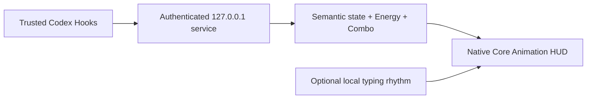

- The service binds only to `127.0.0.1` and uses a private per-installation token.
- Prompts, responses, source code, patch contents, commands, typed characters, key values, clipboard data, credentials, and cursor coordinates are not persisted.
- Accessibility is used only while Codex is foreground, for eligible input rhythm and insertion-point placement.
- There are no third-party runtime packages, analytics, telemetry, or network image downloads.
- Runtime state lives outside the repository and can be reset or removed with bounded maintenance commands.

Read the full [privacy model](docs/PRIVACY.md), [architecture](docs/ARCHITECTURE.md), and [security audit](docs/SECURITY_AUDIT.md).

## Controls

All everyday controls live under the macOS menu-bar bolt.

| Control | Options |
| --- | --- |
| Display | Focus · Arcade · Classic |
| Activity source | Focus · Global · Mix |
| Energy gain | `0.30×` to `1.50×` |
| Effect intensity | Low · Normal · High |
| Cursor effect | Off plus 13 styles |
| Idle | Hide · Quiet orb · 0/2/6 second delay |
| HUD anchoring | Codex window only · Always on screen |
| Accessibility | Typing Combo · permission guide · Reduce Motion |
| Language and size | Automatic · English · 中文 · 90%–150% |
| Position | Direct drag with edge snapping |

## Engineering confidence

- **151 automated tests** covering state semantics, persistence, security, process control, settings, native contracts, and release hygiene.
- **326 deterministic native frames** covering themes, modes, states, Energy tiers, completion outcomes, cursor samples, Typing Combo, and Reduced Motion.
- Native compositor budgets capped at **96 live layers** and **88 animations** in a synthetic peak scenario.
- Reproducible compatibility, stability, performance, security, archive, and interaction checks.
- CI runs the JavaScript suite on Linux and compiles plus self-tests the native Swift overlay on macOS.

Synthetic checks are never presented as proof of real Hook or hands-on behavior. Remaining beta validation is tracked in the [release checklist](docs/RELEASE_CHECKLIST.md).

## Platform and beta boundary

Power Mode currently supports the **Codex desktop app on macOS only**. Codex CLI, VS Code, subagents, Windows, and Linux are outside the current product boundary.

The public beta compiles a stable local **Codex Power Mode.app** identity and uses ad-hoc signing by default. A Developer ID-signed and notarized binary is not distributed yet. See [Compatibility](docs/COMPATIBILITY.md) before describing a specific macOS/Codex combination as fully supported.

## Documentation

| Get started | Understand | Trust | Maintain |
| --- | --- | --- | --- |
| [Installation](docs/INSTALLATION.md) | [Architecture](docs/ARCHITECTURE.md) | [Privacy](docs/PRIVACY.md) | [Troubleshooting](docs/TROUBLESHOOTING.md) |
| [FAQ](docs/FAQ.md) | [Media & visual QA](docs/MEDIA.md) | [Security policy](SECURITY.md) | [Compatibility](docs/COMPATIBILITY.md) |
| [Controls](#controls) | [Dependencies](docs/DEPENDENCIES.md) | [Security audit](docs/SECURITY_AUDIT.md) | [Performance](docs/PERFORMANCE.md) |
| [Contributing](CONTRIBUTING.md) | [Third-party notices](THIRD_PARTY_NOTICES.md) | [Code of conduct](CODE_OF_CONDUCT.md) | [Release checklist](docs/RELEASE_CHECKLIST.md) |

## Contributing

Issues and pull requests are welcome. Keep examples synthetic or redacted. Report vulnerabilities through GitHub private vulnerability reporting rather than a public issue.

<div align="center">

**Make agent work legible. Make useful progress feel alive. Have a little fun while you are here.**

</div>
