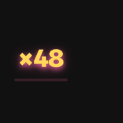
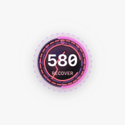

# Codex Power Mode

An agent activity feedback layer designed for Codex. Power Mode turns observing, acting, verifying, waiting, recovering, and completing into legible visual states—without pretending Codex is typing at a keyboard.

> Private incubation project. The repository is intentionally not open source yet.

| Focus · Verify | Arcade · Act | Arcade · Verified |
| --- | --- | --- |
|  |  |  |

Power Mode reads Codex lifecycle signals—not keystrokes or code volume—and turns them into a compact semantic rhythm. Useful edits build Energy, consecutive agent steps build Combo, verification creates evidence-backed rewards, and inactivity visibly decays back to Idle. Everything stays local and the runtime has zero third-party packages.

Documentation: [Installation](docs/INSTALLATION.md) · [Troubleshooting](docs/TROUBLESHOOTING.md) · [Architecture](docs/ARCHITECTURE.md) · [Privacy](docs/PRIVACY.md) · [Dependencies](docs/DEPENDENCIES.md) · [Media](docs/MEDIA.md) · [Security](SECURITY.md) · [Contributing](CONTRIBUTING.md) · [Release checklist](docs/RELEASE_CHECKLIST.md)

## At a glance

| Control | Choices | Purpose |
| --- | --- | --- |
| Visual rhythm | Focus / Arcade | Restrained clarity or high-impact choreography |
| Activity source | Focus / Global / Mix | One task, latest isolated task, or one shared desktop pool |
| Input feedback | Off / Sparks / Neon | Optional local cursor effect and independent Typing Combo |
| Idle behavior | Hide / Quiet orb | Disappear after settling or retain a neutral `0 / Idle` orb |
| Accessibility | Reduce Motion | Preserve semantic state without spatial motion or particles |
| Language | Auto / English / 中文 | Localized HUD labels and menu controls |

Typing Combo and Reduce Motion are shown below. Both are generated from the same native renderer used by the HUD.

| Typing Combo | Reduce Motion · Recover |
| --- | --- |
|  |  |

## Current v0.8.0 private stable

- Maps Codex lifecycle activity into six semantic states: Observe, Act, Verify, Wait, Recover, and Complete.
- Uses a `0–999` Energy scale for useful progress, Confidence for verification evidence, and Risk for change scope; only evidence-backed completion reaches the verified peak.
- Refills the Energy ring inside each tier instead of drawing one slow `0–999` lap: a full ring breaks through, resets for the next tier, and reverses the same sequence while decaying. The orb stays circular while tier colors, glow depth, rings, ticks, and particle intensity escalate.
- Optionally counts local typing rhythm while Codex is the foreground app. A large independent `×N` sits beside the orb, optional Sparks/Neon effects fire at the text cursor, and sending collapses the counter into an authenticated Energy stream without reading, storing, or transmitting text.
- Adds a separate short-lived Combo link for consecutive Codex steps; it never replaces Momentum.
- Gives every Combo increase a visible pulse, expands through five count tiers, warns with a double beat near expiry, and fractures explicitly on disconnect.
- Supports Focus (hold the current conversation), Global (follow the latest conversation with isolated state), and Mix (one shared Energy/Combo pool for all Codex app conversations).
- Decays inactive conversations by real elapsed time before they return to the HUD, then uses a compositor handoff instead of abruptly swapping stale energy values.
- Gives small and large edits equal Momentum; larger changes increase Risk instead.
- Surfaces permission requests as an explicit attention state.
- Measures added and removed lines without storing source code in the HUD event stream.
- Recognizes common test, build, lint, and type-check commands.
- Requires successful post-edit verification for an evidence-backed completion.
- Gives verified, unverified, cancelled, and no-change endings distinct motion rhythms; Focus confirms quietly while Arcade reserves multi-stage impact for evidence-backed success.
- Keeps Act directional with a thrust axis and makes Verify converge through four lock brackets, including static silhouettes when Reduced Motion is enabled.
- Streams events to a compact zero-dependency floating HUD with agent state, confidence, evidence, and risk signals.
- Includes a native macOS transparent, click-through overlay anchored to the Codex window, with an optional global visibility mode.
- Includes semantic demo and recent-event replay tools for visual tuning.
- Holds the final result, lets Combo drain and disconnect, then settles into a neutral Idle state while visible energy returns to zero.
- Drops the static Idle orb to a one-second heartbeat, and suspends the browser presentation timer entirely after auto-hide; new activity or connection changes wake it immediately.
- Keeps reduced-motion feedback semantic: events briefly show a fixed, phase-colored confirmation ring and compact glyph instead of particles, rotation, shaking, or full-screen flashes.
- Auto-hides after settling or keeps a quiet `0 / Idle` orb, while Wait, Recover, and reconnect states remain visible.
- Supports restrained `focus` and high-energy `arcade` effect presets.
- Adds a lightweight macOS menu-bar control for language, effects, idle behavior and its hide delay, size, motion, and drag positioning.
- Keeps saved and preset positions inside the active display's visible area and recovers them after resolution, Dock, or monitor-layout changes.

## Try it locally

Requires Node.js 20 or newer.

```bash
npm start
npm run demo
npm run showcase
npm run showcase:energy
npm run replay
npm run render:qa
```

The HUD runs on `http://127.0.0.1:4737` and binds only to localhost.
Use `npm run showcase` to compare semantic states, or `npm run showcase:energy` to step through all seven Energy tiers. Demo, both showcases, and replay are transient previews: they never change the connected task, energy, Combo, event history, or personal best, and the real HUD state is restored when playback ends.

For the native macOS overlay:

```bash
npm run native
npm run demo
npm run status
npm run doctor
npm run native:stop
```

The native executable is compiled locally with the installed Swift toolchain and cached under the ignored `.power-mode/` directory. It follows the foremost Codex window and does not modify or inject code into the Codex app. **When Codex is inactive** offers three explicit policies: hide the HUD, keep it over the last Codex window position, or re-anchor it to the current foreground app. The two visible policies remain above other apps across displays and Stage Manager groups.

On macOS, the Codex `SessionStart` hook automatically ensures both the event service and native overlay are running. Existing processes are reused, so opening another session does not create duplicate overlays.

`UserPromptSubmit` moves the HUD into Observe immediately after a message is sent, with “Understanding your request” feedback before the first tool call. Power Mode records the lifecycle transition but never stores the prompt text.

`npm run status` reports service health, the native overlay PID and launch configuration, `hudDisplay` for the state currently shown after settling/decay, `taskState` for the last raw task state, and how many demo versus real Codex lifecycle events the running service has received. If `realEventsReceived` remains `0` after Codex uses a tool, review and trust the plugin hooks in Codex.

`npm run doctor` gives a short, non-technical health report for the service, native HUD, installed version, data directory, duplicate processes, event-stream connection, and trusted Codex lifecycle hooks. Use `npm run doctor -- --json` for automation.

## Maintenance and removal

- `npm run stop` safely stops the native HUD and the authenticated local service without deleting settings or history.
- `npm run reset:settings -- --yes` restores display settings and position to defaults, restarts the HUD, and preserves history and personal bests. Without `--yes`, it only explains that confirmation is required.
- `npm run purge:data -- --yes` stops Power Mode and removes its local settings, history, and installation token. It refuses broad or unrecognized directories and does not uninstall the plugin itself.
- Remove the plugin package with `codex plugin remove codex-power-mode@personal`. To remove local data too, run the purge command first.

After an upgrade, `npm run doctor` confirms the installed version, data directory, service/HUD connection, and single-instance state. A notice that hooks are waiting is normal until the next trusted Codex desktop task emits a lifecycle event.

### Typing Combo permission troubleshooting

Run `npm run doctor`. When Typing Combo is enabled, it checks the installed native HUD's macOS Accessibility trust without prompting or exposing cursor coordinates. If permission is missing, open **System Settings → Privacy & Security → Accessibility**, enable the installed `codex-power-mode-overlay`, then restart Power Mode. If permission is granted but cursor effects are unavailable, bring Codex to the foreground and click inside its message input box; the next diagnostic distinguishes that focus state from a missing permission. Typing Combo can also be turned off from the menu-bar bolt, in which case Accessibility permission is not required.

The macOS menu-bar bolt is the settings entry point. Power Mode only tracks conversations opened in the Codex desktop app; CLI and subagent activity is ignored. **Status & connection** separates the current HUD display from the raw task state and lists the last real event, task origin, following policy, connection health, and full session identity. **Activity source** offers Focus, Global, and Mix: Focus protects the current conversation, Global follows the latest conversation while keeping each score isolated, and Mix combines every Codex app conversation into one shared Energy and Combo pool. **Effect intensity** independently controls particle density and impact without changing the Focus/Arcade rhythm, and **Show Combo** can remove the agent Combo ring without spending high-frequency redraws on its hidden decay. **Typing Combo** is a separate opt-in feature that requests macOS Accessibility access, activates only while Codex is the foreground app, ignores control/navigation keys, and records only a capped count and timestamp. **Idle behavior** can keep a quiet orb or hide the HUD; when hiding is selected, **Auto-hide delay** chooses whether it disappears immediately or leaves the settled Idle orb visible for 2 or 6 seconds. **When Codex is inactive** separately controls whether the HUD hides, stays at the last Codex anchor, or follows the active app. Choose **Adjust position…** (or press `⌥⌘P`), drag the HUD inside the Codex window, and release to lock it back into click-through mode. The menu also reports historical best energy and Combo. Settings are saved immediately in the versioned `overlay-config.json` and survive overlay restarts.

Optional environment variables:

- `CODEX_POWER_MODE_EDGE`: `top-right` (default), `top-left`, `bottom-right`, `bottom-left`, or `center`.
- `CODEX_POWER_MODE_REDUCED_MOTION=1`: update the HUD without particles, flashes, or spatial motion while preserving distinct static state markers.
- `CODEX_POWER_MODE_FOLLOW_WHEN_INACTIVE=1`: keep the overlay visible while Codex is behind another app.
- `CODEX_POWER_MODE_PRESET=arcade`: increase particle density, replay cadence, and finisher intensity. The default is `focus`.
- `CODEX_POWER_MODE_INTENSITY=low|normal|high`: tune effect density independently of the semantic preset.
- `CODEX_POWER_MODE_SHOW_COMBO=0`: hide the Combo bar and its decay animation.
- `CODEX_POWER_MODE_TYPING_COMBO=1`: enable the macOS-only input rhythm Combo. Accessibility permission is required; text and key values are never stored or sent.
- `CODEX_POWER_MODE_CURSOR_EFFECT=off|spark|neon`: choose the cursor-local typing effect independently from the large Typing Combo counter.
- `CODEX_POWER_MODE_SCALE`: scale the floating HUD from `0.75` to `1.6`. The default is `1.15` (about 94pt collapsed).
  The HUD automatically scales down when needed to stay inside narrow Codex windows.
- `CODEX_POWER_MODE_IDLE`: `hide` (default) or `orb`.
- `CODEX_POWER_MODE_LANGUAGE`: `auto` (default), `zh-CN`, or `en`.
- `CODEX_POWER_MODE_ACTIVITY_SOURCE`: `focused` (default), `global`, or `mix`.
- `CODEX_POWER_MODE_ENABLED=0`: disable drawing while keeping the local service available.
- `CODEX_POWER_MODE_OBSERVE_THROTTLE_MS`: minimum interval between identical Observe animations. Defaults to `900`; set to `0` to disable coalescing.
- `CODEX_POWER_MODE_PORT`: local event-service port used consistently by the server, hooks, browser HUD, and native overlay. Defaults to `4737`.
- `CODEX_POWER_MODE_AUTO_NATIVE=0`: keep automatic session startup limited to the event service instead of launching the macOS overlay.

Manual runs store state under `~/.codex/power-mode` by default so runtime history is never bundled into the plugin source. Installed hooks continue to use the Codex-provided `PLUGIN_DATA` directory.

## Plugin layout

```text
.codex-plugin/plugin.json   Plugin metadata
hooks/hooks.json            Codex lifecycle hook declarations
hooks/*.mjs                 Session and tool event handlers
skills/power-mode/          User-facing Power Mode workflow
src/                        Event parsing, scoring, and persistence
overlay/                    Real-time visual HUD
scripts/                    Server and control command
test/                       Node test suite
```

Installed plugin hooks must be reviewed and trusted by the user before Codex runs them. Power Mode hooks are observational: they do not block or rewrite tool calls.

## Privacy and safety

- All state stays on the local machine.
- The HUD listens on `127.0.0.1` only.
- Each installation creates a private `0600` service token. Hooks, diagnostics, and the native HUD authenticate every API and event-stream request.
- The browser HUD receives a separate process-scoped, stream-only token through a same-origin bootstrap; cross-origin pages cannot subscribe to HUD state or post events.
- Patch source text is reduced to line and character counts before persistence; command contents are not stored.
- The local service rejects malformed lifecycle events, sensitive prompt/command fields, oversized payloads, and invalid JSON without interrupting Codex work.
- Hook failures never block Codex work.
- There are no runtime dependencies or analytics.
- Focus and Arcade enforce separate particle, shockwave, and scan budgets so bursts cannot accumulate without bound during rapid tool activity.
- Energy spans Wake, Charge, Drive, High, Overload, Critical, and the verified `999` Peak. The ring fills within the current tier, resets after a breakthrough, reverses on decay, and each tier has a distinct material, ring texture, node density, glow, and cadence within the same circular orb silhouette.
- Repeated identical read/search activity is throttled, while Act, Verify, Wait, Recover, and Complete events are never hidden by that throttle.

## Combo semantics

- Typing Combo is local and separate from the agent Combo below. A real `UserPromptSubmit` consumes it into a capped `6/16/32/55/90` Energy charge; it cannot create the verified `999` peak.

- A new Codex tool step starts or extends Combo; edits add one link and successful verification adds two. Every increase pulses the ring, while tier crossings create a larger expansion.
- Observe begins draining immediately. Act gets a 15-second tool hold, Verify gets a 90-second hold, then the bar drains over 12 seconds.
- Permission waits preserve Combo for 15 seconds before draining, so approval latency is not treated as an instant failure.
- Failed verification and unverified completion break Combo immediately.
- An expired link starts again at `1×` with a brief `RELINK` / `重连` bridge; a new turn or Codex session also starts at `1×` but is deliberately not presented as a continuation.
- Combo progresses through Ignite (`1–4×`), Link (`5–9×`), Accel (`10–19×`), Heat (`20–39×`), and Extreme (`40×+`). Its critical cadence emits a double warning near expiry, then the outer ring visibly fractures once after a break.
- Passing checks use three reward tiers: restrained confirmation without a recent edit, green Boost when evidence backs the latest change, and a gold Record beat when that evidence also sets a personal best.

## Roadmap

- Focus, Arcade, Review, and Accessible visual presets.
- More granular tool-family feedback and long-running task milestones.
- Multi-task and subagent presence.
- Native overlays for Windows and Linux.
- Optional sound and richer accessibility controls.
- Signed releases and public-source readiness review.
