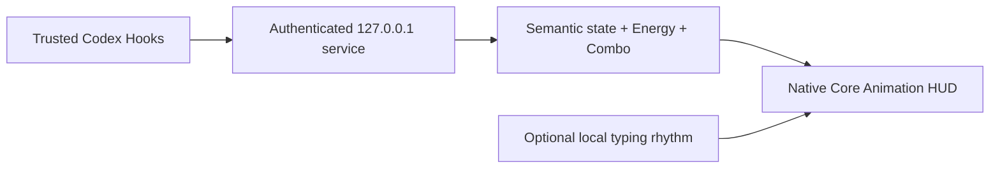

<div align="center">


# Codex Power Mode

### A tiny native HUD for people who think “loading…” is not a personality

Codex is doing real work. It deserves better than a spinner.<br>
Watch it understand, inspect, edit, verify, recover, and finish—then add Energy, Combo, neon sparks, or a suspiciously elegant penguin.

[English](README.md) · [简体中文](README.zh-CN.md)

[](https://github.com/zytsyj/codex-power-mode/actions/workflows/ci.yml)
[](https://github.com/zytsyj/codex-power-mode/releases)
[](LICENSE)
[](docs/COMPATIBILITY.md)
[](docs/DEPENDENCIES.md)

[The idea](#from-editor-fireworks-to-agent-feedback) · [See it move](#see-it-move) · [Quick start](#quick-start) · [Visual system](#one-visual-system-not-a-loading-spinner) · [Privacy](#local-and-private-by-design) · [Documentation](#documentation)

</div>

> [!NOTE]
> Power Mode `0.9.0` is an **open-source public beta**. Source code, documentation, and project-authored media use MIT. Four legacy meme image sets are distributed separately and are not covered by MIT; see [Third-party notices](THIRD_PARTY_NOTICES.md).

## From editor fireworks to agent feedback

The idea started with the old VS Code Power Mode experience: hit a key, get an immediate burst of particles, screen shake, and Combo. It was a wonderfully unnecessary way to make coding feel physical. The magic was not really the explosions—it was the tight little loop between doing something and feeling the editor answer back.

The first Codex prototype took that idea almost literally. A large patch became a burst of virtual typing; edits made sparks, tests charged the meter, and verified work earned a victory finish. It looked lively, but something felt off. Codex is not simply typing on your behalf. Much of the interesting work happens while it is understanding a request, inspecting a project, choosing a change, running tools, checking the result, waiting for approval, or recovering from failure.

So the question changed: **what would Power Mode look like if it reacted to the work itself, not just the keyboard?**

That question became this project. Keystrokes still have a place in **Classic Power Mode**, but the main HUD follows Codex's real lifecycle. Observe pulls energy inward. Act drives the mechanism forward. Verify locks the nodes. Failures visibly recover. Useful work builds Energy, while completion only gets the celebration it actually earned. It keeps the instant delight of the old editor effect, then gives it a visual language made for an agent.

## See it move

Every preview below is generated from the native renderer with synthetic state. No prompt, code, task name, or personal data is used.

<table>
  <tr>
    <th width="25%">Focus</th>
    <th width="25%">Arcade</th>
    <th width="25%">Energy evolution</th>
    <th width="25%">Completion outcomes</th>
  </tr>
  <tr>
    <td align="center"></td>
    <td align="center"></td>
    <td align="center"></td>
    <td align="center"></td>
  </tr>
  <tr>
    <td>Calm and readable for long sessions.</td>
    <td>Stronger impacts and richer choreography.</td>
    <td>One mechanism evolves through five tiers.</td>
    <td>Verified, unverified, cancelled, or no change.</td>
  </tr>
</table>

## Quick start

### Install as a Codex plugin

```bash
codex plugin marketplace add zytsyj/codex-power-mode
codex plugin add codex-power-mode@codex-power-mode
```

Then open a new Codex desktop task:

1. Review and trust the plugin Hooks when Codex asks.
2. The first trusted task starts one local service and one native HUD.
3. Choose **Use basic mode** or **Enable & grant access…** in the first-run guide.
4. Ask Codex to **check Power Mode status** whenever you want a health report.

Power Mode cannot click either operating-system security confirmation for you. It can explain the requirement, request Accessibility access, and open the exact macOS settings panel. Permission changes are detected without restarting the HUD.

<details>
<summary><strong>Run from a source checkout</strong></summary>

```bash
npm install
npm run check
npm run native
```

Useful development previews:

```bash
npm run showcase
npm run showcase:energy
npm run showcase:complete
npm run render:qa
```

</details>

## At a glance

| Native HUD | Semantic model | Feedback | Workflow |
| --- | --- | --- | --- |
| Focus, Arcade, and no-orb Classic | 6 agent states and 5 Energy tiers | Agent Combo, Typing Combo, 13 cursor styles | Focus, Global, and Mix activity sources |
| Direct drag and right-click settings | 4 honest completion outcomes | Low/Normal/High intensity | Auto-start, health checks, reset, and removal |
| Light/dark adaptation | Evidence-aware verification | Reduced Motion | English and Chinese controls |
| Click-through empty space | Smooth decay and return | Immediate effect replacement | Menu-bar settings |

## One visual system, not a loading spinner

Power Mode consumes trusted Codex lifecycle events and turns them into a stable visual grammar:

| State | Meaning | Motion language |
| --- | --- | --- |
| **Observe** | Understanding, reading, searching | Flow pulls inward |
| **Act** | Editing or executing useful work | Directional bus accelerates |
| **Verify** | Tests, builds, lint, type checks | Nodes lock in sequence |
| **Wait** | User approval is required | Mechanism latches and holds |
| **Recover** | A command or verification failed | Circuit reverses and repairs |
| **Complete** | The turn has ended | Rings close, stamp the outcome, then settle |

The center value and activity label remain a permanent no-draw zone. State animation never needs to overlap the number to communicate.

### Five Energy tiers

Energy ranges from `0` to `999`. Reaching `900` always enters the highest tier.

| Energy | Tier | Mechanical evolution |
| ---: | --- | --- |
| `0–199` | **Wake** | Base chassis comes online |
| `200–449` | **Charge** | Three nodes separate and orbit |
| `450–699` | **Drive** | A four-node directional bus engages |
| `700–899` | **Critical** | Six locks assemble around a stabilizer |
| `900–999` | **Peak** | The full mechanism phase-synchronizes under a white-gold crown |

Energy rewards useful state transitions and verification—not code volume. Large diffs raise risk instead of farming points.

## Three display modes

| Mode | Best for | What stays visible |
| --- | --- | --- |
| **Focus** | Long sessions and maximum readability | Semantic orb, Energy, optional Combo |
| **Arcade** | Stronger audiovisual-style feedback | The same model with richer impacts and particles |
| **Classic Power Mode** | Traditional typing feedback | No orb; only cursor effects and Typing Combo |

Classic mode leaves no invisible hit target when its feedback has finished.

## Completion that tells the truth

All tasks do not deserve the same celebration:

| Outcome | Condition | Visual result |
| --- | --- | --- |
| **Verified** | The latest edit is followed by successful evidence | Three reward rings |
| **Unverified** | Files changed without successful follow-up evidence | Caution gap remains open |
| **Cancelled** | Work stops while waiting or is explicitly cancelled | Split arcs retract |
| **No change** | The turn finishes without modifying code | Thin cyan ring settles quietly |

### Focus, Global, and Mix

| Activity source | Behavior |
| --- | --- |
| **Focus** | Keep the current conversation on the HUD |
| **Global** | Follow the latest Codex desktop conversation while preserving isolated state |
| **Mix** | Share one Energy and Combo pool across desktop conversations |

In Mix, each conversation gets a brief verified/unverified/cancelled/no-change stamp without resetting the shared pool. The last active conversation receives the full completion animation.

## Serious work, unserious cursor effects

Some days call for a quiet spark. Other days call for a liquid wormhole, a judgmental orange cat, or a possum silently supervising the pull request.

<table>
  <tr>
    <th width="33%">Power</th>
    <th width="33%">Abstract chaos</th>
    <th width="33%">Meme department</th>
  </tr>
  <tr>
    <td align="center"></td>
    <td align="center"></td>
    <td align="center"></td>
  </tr>
  <tr>
    <td>Spark · Orbit · Ripple · Prism · Neon</td>
    <td>Wormhole · Glitch · Tentacle · 典急孝乐绷赢</td>
    <td>Possum · Fresh Cat · Knife-shield Dog · Elegant Person</td>
  </tr>
</table>

Cursor effects are optional and independent from the large Typing Combo counter. Fast input never becomes a sticker traffic jam: every new effect dismisses the previous one immediately. The four legacy sticker families ship locally, so nothing is fetched at runtime; their separate rights status is documented in [Third-party notices](THIRD_PARTY_NOTICES.md).

## Permissions without surprises

The bilingual first-run guide explains both confirmations and can be reopened from the menu-bar bolt.

| Confirmation | Who owns it | What Power Mode can do |
| --- | --- | --- |
| **Codex Hook trust** | Codex | Explain why it is needed; Codex displays the actual trust prompt |
| **macOS Accessibility** | macOS | Trigger the system request and open **Privacy & Security → Accessibility** |

Accessibility is optional. Basic semantic HUD, Energy, Agent Combo, Mix, and completion feedback work without it. It is required only for Typing Combo and cursor-local placement.

## Local and private by design



- The service binds only to `127.0.0.1` and uses a private per-installation token.
- Prompts, responses, source code, patch contents, commands, typed characters, key values, clipboard data, credentials, and cursor coordinates are not persisted.
- Accessibility is used only while Codex is foreground, for eligible input rhythm and insertion-point placement.
- There are no third-party runtime packages, analytics, telemetry, or network image downloads.
- Runtime state lives outside the repository and can be reset or removed with bounded maintenance commands.

Read the full [privacy model](docs/PRIVACY.md), [architecture](docs/ARCHITECTURE.md), and [security audit](docs/SECURITY_AUDIT.md).

## Controls

All everyday controls live under the macOS menu-bar bolt.

| Control | Options |
| --- | --- |
| Display | Focus · Arcade · Classic |
| Activity source | Focus · Global · Mix |
| Energy gain | `0.30×` to `1.50×` |
| Effect intensity | Low · Normal · High |
| Cursor effect | Off plus 13 styles |
| Idle | Hide · Quiet orb · 0/2/6 second delay |
| HUD anchoring | Codex window only · Always on screen |
| Accessibility | Typing Combo · permission guide · Reduce Motion |
| Language and size | Automatic · English · 中文 · 90%–150% |
| Position | Direct drag with edge snapping |

## Engineering confidence

- **150 automated tests** covering state semantics, persistence, security, process control, settings, native contracts, and release hygiene.
- **326 deterministic native frames** covering themes, modes, states, Energy tiers, completion outcomes, cursor samples, Typing Combo, and Reduced Motion.
- Native compositor budgets capped at **96 live layers** and **88 animations** in a synthetic peak scenario.
- Reproducible compatibility, stability, performance, security, archive, and interaction checks.
- CI runs the JavaScript suite on Linux and compiles plus self-tests the native Swift overlay on macOS.

Synthetic checks are never presented as proof of real Hook or hands-on behavior. Remaining beta validation is tracked in the [release checklist](docs/RELEASE_CHECKLIST.md).

## Platform and beta boundary

Power Mode currently supports the **Codex desktop app on macOS only**. Codex CLI, VS Code, subagents, Windows, and Linux are outside the current product boundary.

The public beta compiles a stable local **Codex Power Mode.app** identity and uses ad-hoc signing by default. A Developer ID-signed and notarized binary is not distributed yet. See [Compatibility](docs/COMPATIBILITY.md) before describing a specific macOS/Codex combination as fully supported.

## Documentation

| Get started | Understand | Trust | Maintain |
| --- | --- | --- | --- |
| [Installation](docs/INSTALLATION.md) | [Architecture](docs/ARCHITECTURE.md) | [Privacy](docs/PRIVACY.md) | [Troubleshooting](docs/TROUBLESHOOTING.md) |
| [FAQ](docs/FAQ.md) | [Media & visual QA](docs/MEDIA.md) | [Security policy](SECURITY.md) | [Compatibility](docs/COMPATIBILITY.md) |
| [Controls](#controls) | [Dependencies](docs/DEPENDENCIES.md) | [Security audit](docs/SECURITY_AUDIT.md) | [Performance](docs/PERFORMANCE.md) |
| [Contributing](CONTRIBUTING.md) | [Third-party notices](THIRD_PARTY_NOTICES.md) | [Code of conduct](CODE_OF_CONDUCT.md) | [Release checklist](docs/RELEASE_CHECKLIST.md) |

## Contributing

Issues and pull requests are welcome. Keep examples synthetic or redacted. Report vulnerabilities through GitHub private vulnerability reporting rather than a public issue.

<div align="center">

**Make agent work legible. Make useful progress feel alive. Have a little fun while you are here.**

</div>
