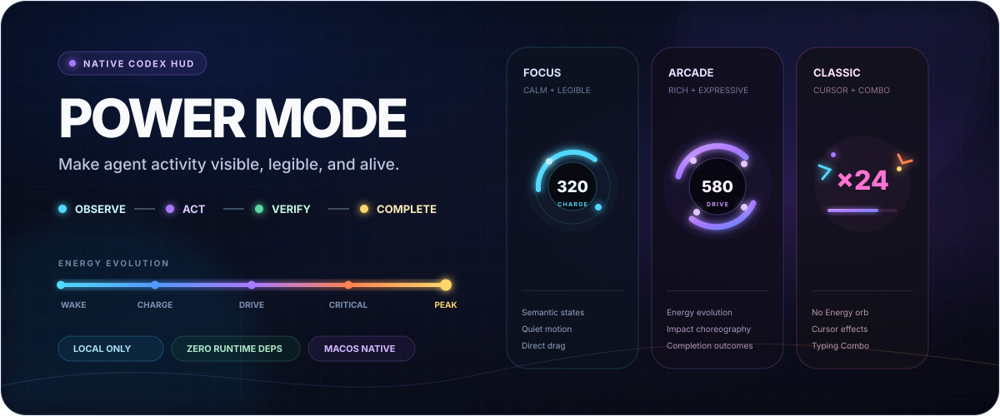
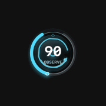
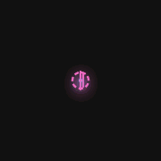
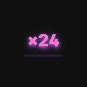
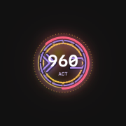
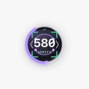
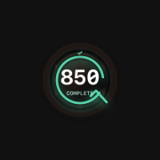
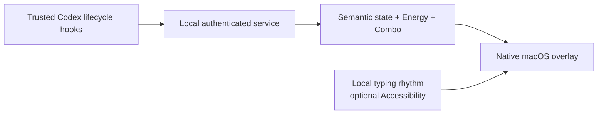

<div align="center">



# Codex Power Mode

**A native semantic HUD that makes Codex activity visible.**

Understand what the agent is doing, watch useful work build Energy, and turn typing into tactile feedback—without reading or storing your content.

[English](README.md) · [简体中文](README.zh-CN.md)

[](docs/INSTALLATION.md)
[](package.json)
[](docs/DEPENDENCIES.md)
[](CHANGELOG.md)
[](LICENSE)
[](docs/RELEASE_CHECKLIST.md)

[Install](#installation) · [Modes](#three-display-modes) · [How it works](#how-it-works) · [Privacy](#local-and-private-by-design) · [Documentation](#documentation)

</div>

> [!NOTE]
> Power Mode `0.9.0` is an open-source public beta. Source code, documentation, and project-authored media use the MIT license. Four legacy meme image sets are distributed separately and are not covered by MIT; see [Third-party notices](THIRD_PARTY_NOTICES.md).

## See Codex work—not just spin

Power Mode converts trusted Codex desktop lifecycle events into a compact, native macOS overlay. It distinguishes understanding, reading, editing, verification, waiting, recovery, and completion instead of reducing every task to a generic loading indicator.

<table>
  <tr>
    <th width="33%">Focus</th>
    <th width="33%">Arcade</th>
    <th width="33%">Classic Power Mode</th>
  </tr>
  <tr>
    <td align="center"></td>
    <td align="center"></td>
    <td align="center"></td>
  </tr>
  <tr>
    <td>Quiet, legible semantic motion.</td>
    <td>Stronger impacts and richer choreography.</td>
    <td>No orb—only cursor effects and Typing Combo.</td>
  </tr>
</table>

## What the current version includes

- **Three display modes.** Focus, Arcade, and the new no-orb Classic Power Mode.
- **Five Energy tiers.** Wake, Charge, Drive, Critical, and Peak evolve one connected mechanism from `1` to `999`; `900+` is always Peak.
- **Six semantic states.** Observe, Act, Verify, Wait, Recover, and Complete each have a distinct, stable visual grammar.
- **Two independent Combos.** Agent Combo reflects consecutive Codex steps; Typing Combo reflects local input rhythm.
- **Four completion outcomes.** Verified, unverified, cancelled, and no-change tasks never share a misleading finish.
- **Thirteen cursor styles.** Sparks, Neon, Orbit, Ripple, Prism, Wormhole, Glitch, Tentacle, meme words, Hands-behind Possum, Fresh Cat, Knife-shield Dog, and Elegant Person.
- **Direct positioning.** Drag the orb—or the active Classic counter—where you want it. Empty overlay space remains click-through.
- **Multi-task policies.** Focus one conversation, follow the latest, or combine desktop conversations into a shared Mix pool.
- **Accessibility controls.** Reduced Motion, light/dark adaptation, bilingual HUD controls, scaling, auto-hide, and inactive-app policies.

## Energy that visibly evolves

Energy is not a decorative progress number. Each tier changes the same connected machine while preserving its identity.

| Energy | Tier | Evolution |
| ---: | --- | --- |
| `1–199` | **Wake** | The chassis comes online |
| `200–449` | **Charge** | Three nodes separate and begin to orbit |
| `450–699` | **Drive** | A four-node directional bus engages |
| `700–899` | **Critical** | Six locks and a stabilizer assemble |
| `900–999` | **Peak** | The mechanism synchronizes under a white-gold crown |

<p align="center">
  
  &nbsp;&nbsp;
  
  &nbsp;&nbsp;
  
</p>

## Three display modes

### Focus

The default. It keeps motion restrained and prioritizes readable state changes for long sessions.

### Arcade

Uses the same state and Energy model with denser particles, stronger breakthroughs, and more expressive completion beats.

### Classic Power Mode

Removes the Energy orb and semantic mechanism entirely. Only the selected cursor effect and a centered Typing Combo remain. Selecting Classic automatically enables Typing Combo; when the Combo expires, the overlay leaves no invisible hit target behind.

## Cursor feedback with personality

Choose a restrained cursor-local effect or something deliberately playful. Sticker modes ship with their complete local assets, so a checkout works without downloading images at runtime.

| Precise | Abstract | Meme |
| --- | --- | --- |
| Sparks · Neon · Orbit · Ripple | Prism · Wormhole · Glitch · Tentacle | 典急孝乐绷赢 · 背手负鼠 · 新鲜猫 · 刀盾狗 · 高雅人士 |

Cursor feedback is independent of the large Typing Combo counter. A new effect replaces the previous one immediately to prevent visual stacking during fast input.

## How it works



- Hooks reduce activity to semantic events and aggregate counts.
- A loopback-only service maintains per-conversation or shared state.
- The native Core Animation HUD follows the relevant Codex window.
- The browser preview exists for development; the product experience is the native overlay.

The overlay does not inject code into Codex and does not reward code volume. Verification quality, useful steps, timing, and task outcomes drive the visible feedback.

## Installation

### Requirements

- macOS with the Codex desktop app
- Node.js 20 or newer
- The macOS Swift toolchain
- One-click macOS Accessibility onboarding only for Typing Combo and cursor-local effects; permission activates without a HUD restart

### Install from GitHub

Add this repository as a Codex plugin marketplace, then install Power Mode:

```bash
codex plugin marketplace add zytsyj/codex-power-mode
codex plugin add codex-power-mode@codex-power-mode
```

Open a new Codex task, review and trust the lifecycle hooks, then verify the installation:

```bash
npm run doctor
```

The first trusted desktop task starts one authenticated local service and one native HUD. See the full [installation and maintenance guide](docs/INSTALLATION.md) for upgrades, reset, removal, and permission troubleshooting.

### Source checkout

```bash
npm install
npm run check
npm run native
```

Useful development commands:

```bash
npm run demo
npm run showcase
npm run showcase:energy
npm run showcase:complete
npm run render:qa
npm run status
```

## Local and private by design

- The service binds only to `127.0.0.1` and authenticates every local client.
- Prompts, responses, source code, patch contents, command text, typed characters, key values, clipboard data, credentials, and cursor coordinates are not persisted.
- Accessibility is used only to count eligible rhythm and locate the active insertion point while Codex is foreground.
- Runtime state stays outside the repository and can be removed with the bounded purge command.
- There are no third-party runtime packages, analytics, or telemetry.

Read the complete [privacy model](docs/PRIVACY.md), [architecture](docs/ARCHITECTURE.md), and [security audit](docs/SECURITY_AUDIT.md).

## Quality gates

The current implementation is guarded by:

- **146 automated tests** covering lifecycle semantics, persistence, security, process control, settings, rendering contracts, and release hygiene.
- **326 deterministic native frames** across light/dark themes, Focus, Arcade, Classic, Reduced Motion, all semantic states, Energy tiers, completion outcomes, cursor samples, and Typing Combo palettes.
- **Native compositor budgets** capped at 96 live layers and 88 animations under a synthetic peak scenario.
- Reproducible compatibility, stability, performance, security, archive, and interaction checks.

Synthetic checks are not presented as proof of real Hook or hands-on behavior. Public-beta follow-up validation is tracked in the [release checklist](docs/RELEASE_CHECKLIST.md).

## Controls

All everyday settings live under the macOS menu-bar bolt.

| Control | Options |
| --- | --- |
| Display mode | Focus · Arcade · Classic Power Mode |
| Activity source | Focus · Global · Mix |
| Energy gain | `0.30×` through `1.50×` |
| Effect intensity | Low · Normal · High |
| Cursor effect | Off plus thirteen visual styles |
| Idle | Hide · Quiet orb · immediate/2s/6s delay |
| Inactive Codex | Hide · Stay over Codex · Follow foreground app |
| Accessibility | Reduce Motion |
| Language | Automatic · English · 中文 |
| Position | Direct drag with edge snapping |

## Platform and project status

Power Mode currently supports the Codex desktop app on macOS only. Codex CLI, VS Code, subagents, Windows, and Linux are outside the current product boundary.

The native HUD is packaged locally as a stable **Codex Power Mode.app** identity. The public beta compiles it locally and uses ad-hoc signing by default; a Developer ID-signed and notarized binary is not distributed yet. macOS 13 or newer is the current build target, while the final tested support matrix remains intentionally conservative.

## Documentation

| Use | Build | Trust | Release |
| --- | --- | --- | --- |
| [Installation](docs/INSTALLATION.md) | [Architecture](docs/ARCHITECTURE.md) | [Privacy](docs/PRIVACY.md) | [Release checklist](docs/RELEASE_CHECKLIST.md) |
| [FAQ](docs/FAQ.md) | [Media & QA](docs/MEDIA.md) | [Security](SECURITY.md) | [Compatibility](docs/COMPATIBILITY.md) |
| [Troubleshooting](docs/TROUBLESHOOTING.md) | [Dependencies](docs/DEPENDENCIES.md) | [Security audit](docs/SECURITY_AUDIT.md) | [Performance](docs/PERFORMANCE.md) |
| [Maintenance](docs/INSTALLATION.md#stop-reset-and-remove) | [Contributing](CONTRIBUTING.md) | [Third-party notices](THIRD_PARTY_NOTICES.md) | [Stability](docs/STABILITY.md) |

## Contributing

Issues and pull requests are welcome. Keep examples synthetic or redacted, and report vulnerabilities through GitHub private vulnerability reporting rather than public issues.

See [CONTRIBUTING.md](CONTRIBUTING.md), [CODE_OF_CONDUCT.md](CODE_OF_CONDUCT.md), and the [FAQ](docs/FAQ.md).

<div align="center">

Built for people who want agent activity to feel legible, responsive, and alive.

</div>
