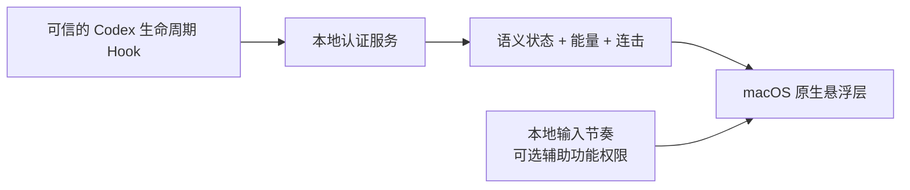

<div align="center">


# Codex Power Mode

**让 Codex 工作过程真正可见的原生语义状态 HUD。**

看懂智能体正在做什么，感受有效工作积累能量，并把输入节奏变成即时反馈——不读取、不保存你的内容。

[English](README.md) · [简体中文](README.zh-CN.md)

[](docs/INSTALLATION.md)
[](package.json)
[](docs/DEPENDENCIES.md)
[](CHANGELOG.md)
[](LICENSE)
[](docs/RELEASE_CHECKLIST.md)

[安装](#安装) · [显示模式](#三种显示模式) · [工作原理](#工作原理) · [隐私](#本地运行隐私优先) · [文档](#文档)

</div>

> [!NOTE]
> Power Mode `0.9.0` 是开源公开测试版。源码、文档和项目自制媒体采用 MIT 许可证；四组旧梗图素材单独分发，不包含在 MIT 授权内，详见[第三方声明](THIRD_PARTY_NOTICES.md)。

## 不只是转圈，而是看懂 Codex 在做什么

Power Mode 将可信的 Codex 桌面端生命周期事件转换成紧凑的 macOS 原生悬浮层。理解、读取、修改、验证、等待、恢复和完成都有明确区别，不再用一个通用加载动画代表所有工作。

<table>
  <tr>
    <th width="33%">专注模式</th>
    <th width="33%">街机模式</th>
    <th width="33%">经典 Power Mode</th>
  </tr>
  <tr>
    <td align="center"></td>
    <td align="center"></td>
    <td align="center"></td>
  </tr>
  <tr>
    <td>克制、清晰的语义动画。</td>
    <td>更强冲击与更丰富的状态演出。</td>
    <td>没有小球，只保留光标特效与输入连击。</td>
  </tr>
</table>

## 当前版本包含什么

- **三种显示模式。** 专注、街机，以及全新的无小球经典 Power Mode。
- **五档能量进化。** Wake、Charge、Drive、Critical、Peak 从 `1` 到 `999` 逐步组装同一套机械结构；达到 `900` 即进入最高档。
- **六种语义状态。** Observe、Act、Verify、Wait、Recover、Complete 各自拥有稳定且不同的视觉语言。
- **两套独立连击。** Agent Combo 表示 Codex 连续工作步骤；Typing Combo 表示本地输入节奏。
- **四种完成结果。** 已验证、未验证、已取消、无修改不会共用误导性的完成效果。
- **十三种光标风格。** 火花、霓虹、轨道、涟漪、棱镜、虫洞、故障切片、柔性触手、抽象弹字、背手负鼠、新鲜猫、刀盾狗和高雅人士。
- **直接拖动定位。** 随时拖动小球或经典模式下的连击数字；悬浮层空白区域始终可穿透点击。
- **多任务跟随策略。** 固定一个会话、跟随最新会话，或把多个桌面会话合并到同一个 Mix 能量池。
- **完整可访问性设置。** 减少动态效果、明暗主题适配、中英文界面、缩放、自动隐藏和非活跃应用行为。

## 看得见的能量进化

能量不是装饰性的进度数字。每个档位都会改变同一套机械结构，同时保持连续的视觉身份。

| 能量 | 档位 | 进化表现 |
| ---: | --- | --- |
| `1–199` | **Wake / 唤醒** | 基础框架启动 |
| `200–449` | **Charge / 充能** | 三个节点分离并开始环绕 |
| `450–699` | **Drive / 驱动** | 四节点方向总线接合 |
| `700–899` | **Critical / 临界** | 六个锁点与稳定器完成组装 |
| `900–999` | **Peak / 巅峰** | 机械系统在白金冠标下完全同步 |

<p align="center">
  
  &nbsp;&nbsp;
  
  &nbsp;&nbsp;
  
</p>

## 三种显示模式

### 专注模式

默认模式。动画更加克制，优先保证长时间工作中的状态可读性。

### 街机模式

沿用相同的状态和能量模型，但提供更密集的粒子、更强的突破反馈以及更有表现力的完成演出。

### 经典 Power Mode

彻底移除能量小球和语义机械结构，只保留当前选择的光标特效与居中的输入连击。选择经典模式时会自动开启 Typing Combo；连击结束后不会留下任何不可见的点击拦截区域。

## 有个性的光标反馈

既可以选择克制精确的局部特效，也可以选择故意抽象搞怪的效果。贴纸模式所需素材完整保存在仓库中，拉取代码后无需运行时联网下载。

| 精确 | 抽象 | 国内互联网风格 |
| --- | --- | --- |
| 火花 · 霓虹 · 轨道 · 涟漪 | 棱镜 · 虫洞 · 故障切片 · 柔性触手 | 典急孝乐绷赢 · 背手负鼠 · 新鲜猫 · 刀盾狗 · 高雅人士 |

光标特效与大型 Typing Combo 数字互相独立。快速输入时，新特效会立即替换旧特效，避免叠加遮挡。

## 工作原理



- Hook 只把活动压缩成语义事件和汇总计数。
- 仅监听回环地址的服务维护独立会话或共享状态。
- 基于 Core Animation 的原生 HUD 跟随对应的 Codex 窗口。
- 浏览器预览只服务于开发，实际产品体验是原生悬浮层。

悬浮层不会向 Codex 注入代码，也不会按代码行数奖励用户。验证质量、有效步骤、节奏和任务结果共同决定最终反馈。

## 安装

### 环境要求

- macOS 与 Codex 桌面端
- Node.js 20 或更高版本
- macOS Swift 工具链
- 只有 Typing Combo 和光标局部特效需要辅助功能权限；一键定位到系统设置，授权后无需重启即可生效

### 从 GitHub 安装

先把本仓库添加为 Codex 插件市场，再安装 Power Mode：

```bash
codex plugin marketplace add zytsyj/codex-power-mode
codex plugin add codex-power-mode@codex-power-mode
```

安装后新建一个 Codex 任务，检查并信任生命周期 Hook，然后验证运行状态：

```bash
npm run doctor
```

第一个可信桌面任务会自动启动唯一的本地认证服务和唯一的原生 HUD。升级、重置、卸载与权限排查请阅读完整的[安装与维护文档](docs/INSTALLATION.md)。

### 从源码运行

```bash
npm install
npm run check
npm run native
```

常用开发命令：

```bash
npm run demo
npm run showcase
npm run showcase:energy
npm run showcase:complete
npm run render:qa
npm run status
```

## 本地运行，隐私优先

- 服务仅绑定 `127.0.0.1`，并认证所有本地客户端。
- 不保存提示词、回复、源代码、补丁内容、命令文本、输入字符、按键值、剪贴板数据、凭据或光标坐标。
- 辅助功能权限只用于统计有效输入节奏，并在 Codex 位于前台时定位当前插入点。
- 运行状态保存在仓库之外，并可通过边界严格的数据清理命令删除。
- 没有第三方运行时依赖、分析或遥测。

完整说明请阅读[隐私模型](docs/PRIVACY.md)、[系统架构](docs/ARCHITECTURE.md)与[安全审计](docs/SECURITY_AUDIT.md)。

## 质量保障

当前实现具备以下自动化保障：

- **146 项自动化测试**，覆盖生命周期语义、持久化、安全、进程控制、设置、渲染契约与发布卫生。
- **326 张确定性原生画面**，覆盖明暗主题、专注、街机、经典、减少动态效果、全部语义状态、能量档位、完成结果、光标样例与 Typing Combo 配色。
- **原生合成器预算**，峰值合成场景最多 96 个活动图层和 88 个动画。
- 可复现的兼容性、稳定性、性能、安全、归档与交互验收流程。

合成检查不会被包装成真实 Hook 或人工体验证明。公开测试版的后续验证项目记录在[发布检查清单](docs/RELEASE_CHECKLIST.md)中。

## 控制项

日常设置全部集中在 macOS 菜单栏的闪电图标中。

| 控制项 | 可选项 |
| --- | --- |
| 显示模式 | 专注 · 街机 · 经典 Power Mode |
| 活动来源 | 固定当前 · 跟随最新 · Mix 共享 |
| 能量增益 | `0.30×` 至 `1.50×` |
| 特效强度 | 低 · 标准 · 高 |
| 光标特效 | 关闭以及十三种视觉风格 |
| 空闲行为 | 隐藏 · 静态小球 · 立即/2秒/6秒延迟 |
| Codex 不活跃时 | 隐藏 · 留在 Codex · 跟随前台应用 |
| 辅助功能 | 减少动态效果 |
| 语言 | 自动 · English · 中文 |
| 位置 | 直接拖动并自动靠边吸附 |

## 平台与项目状态

Power Mode 目前仅支持 macOS 上的 Codex 桌面端。Codex CLI、VS Code、子代理、Windows 与 Linux 不在当前产品边界内。

原生 HUD 会在本地打包成身份稳定的 **Codex Power Mode.app**。公开测试版默认使用本地编译和 ad-hoc 签名，尚未提供 Developer ID 签名与公证的预编译应用。当前构建目标为 macOS 13 或更高版本，最终测试支持矩阵仍保持保守。

## 文档

| 使用 | 构建 | 信任 | 发布 |
| --- | --- | --- | --- |
| [安装](docs/INSTALLATION.md) | [架构](docs/ARCHITECTURE.md) | [隐私](docs/PRIVACY.md) | [发布清单](docs/RELEASE_CHECKLIST.md) |
| [常见问题](docs/FAQ.md) | [媒体与画面检查](docs/MEDIA.md) | [安全策略](SECURITY.md) | [兼容性](docs/COMPATIBILITY.md) |
| [故障排查](docs/TROUBLESHOOTING.md) | [依赖](docs/DEPENDENCIES.md) | [安全审计](docs/SECURITY_AUDIT.md) | [性能](docs/PERFORMANCE.md) |
| [维护与卸载](docs/INSTALLATION.md#stop-reset-and-remove) | [贡献指南](CONTRIBUTING.md) | [第三方声明](THIRD_PARTY_NOTICES.md) | [稳定性](docs/STABILITY.md) |

## 参与贡献

欢迎提交 Issue 和 Pull Request。示例与截图必须使用合成或脱敏内容；安全漏洞请通过 GitHub 私密漏洞报告提交，不要公开披露。

参阅 [CONTRIBUTING.md](CONTRIBUTING.md)、[CODE_OF_CONDUCT.md](CODE_OF_CONDUCT.md) 和[常见问题](docs/FAQ.md)。

<div align="center">

为希望智能体工作既清晰、及时，又真正有生命力的人而做。

</div>
