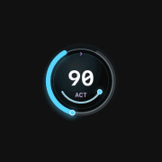
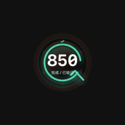
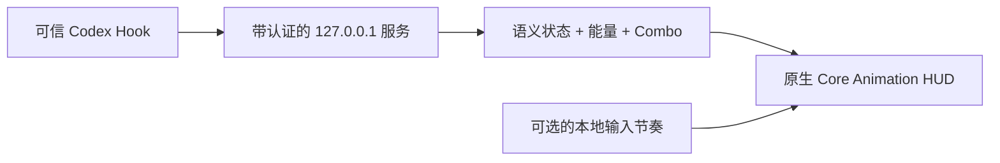

<div align="center">


# Codex Power Mode

### 给觉得“加载中……”实在没什么个性的人

Codex 都认真干活了，当然不能只配一个转圈圈。<br>
看它理解、读取、修改、验证、恢复和完成，再按心情加上能量、连击、霓虹火花，或者一只高雅人士。

[English](README.md) · [简体中文](README.zh-CN.md)

[](https://github.com/zytsyj/codex-power-mode/actions/workflows/ci.yml)
[](https://github.com/zytsyj/codex-power-mode/releases)
[](LICENSE)
[](docs/COMPATIBILITY.md)
[](docs/DEPENDENCIES.md)

[为什么从 VS Code 搬到 Codex](#当-vs-code-退到后台) · [Vibe Coding 声明](#大部分也是-codex-写的bug-可能也是) · [动态预览](#动态预览) · [快速安装](#快速安装) · [隐私](#本地运行隐私优先) · [文档](#文档)

</div>

> [!NOTE]
> Power Mode `0.9.1` 是**开源公开测试版**。源码、文档和项目自制媒体采用 MIT；四组旧梗图素材单独分发，不属于 MIT 授权范围，详见[第三方声明](THIRD_PARTY_NOTICES.md)。

> [!WARNING]
> **一份不太严肃的 vibe coding 声明：**这是一颗编程糖，不是什么关键任务监控仪表。它可能偶尔漏掉连击、慢半拍才看懂状态、小球突然抽一下、跟丢屏幕，或者偏偏在你最想看烟花的时候安静装死。Power Mode 只是想让 Codex 干活的过程更有感觉、更好玩；它不知道模型心里在想什么，也不代表任务真实完成了百分之多少。HUD 哪天犯病，Codex 也应该继续正常干活。欢迎提交 Bug、毛边，以及各种很难解释但确实发生了的怪事。

## 当 VS Code 退到后台

以前写代码，一天大半时间都泡在 VS Code 里。代码是我看的，键盘是我敲的，Power Mode 就负责给每一下输入配上粒子、震动和 Combo。它没什么生产力，甚至有点多余，但就是这种多余，让亲手写代码这件事有了手感。

后来 Codex 慢慢替代了 VS Code，成了我真正干活的地方。现在更多时候，我只需要说清楚想要什么，Codex 自己去读仓库、找文件、改代码、跑测试。我当然还是关心代码，但已经不会全程盯着每一行了。编辑器退到了后台，坐在“键盘前”干活的也不再是我。

这时候再看以前的 Power Mode，就会觉得它被留在了上一代工作方式里。既然工作从 VS Code 搬到了 Codex，从人的手上交给了智能体，那 Power Mode 也应该一起搬过来。

第一版其实很直接：把 Codex 的 patch 假装成一阵高速打字，再给它加火花和连击。热闹是热闹，但总像在假装工作方式没有变。后来干脆不再给“键盘”做动画，而是给“干活的人”做动画：理解、搜索、修改、验证、等待、失败、恢复、完成。你可能已经不怎么看代码了，但仍然能感觉到事情正在往前走。

但人并没有因此变成观众。你写完需求按下提交时，刚才积累的输入连击会被小球吸进去，变成一笔刻意加重的能量。默认设置下，`40+` 输入连击会一次注入 `65` 点，差不多抵得上 Codex 连续做 3–6 次普通状态动作。Codex 后面也许会跑几十步，但决定这些步骤往哪里跑的，仍然是人的那次输入，所以它理应比某一个机械动作更有分量。Power Mode 不知道你写了什么，它只是把“这份意图由你提出并提交”这件事算得更重。

所以这个项目说到底，就是：**当人从码农变成导演、Codex 坐到操作台前之后，Power Mode 应该长什么样。** 经典模式把以前敲键盘放烟花的快乐留了下来；小球和整套状态动画，则是它来到 Codex 之后的新形态。

## 大部分也是 Codex 写的，Bug 可能也是

这个项目大部分是和 AI 一起 Vibe Coding 出来的，主要就是 Codex。我负责想法、审美、最终拍板，以及很多轮“还是不太行”；Codex 负责了大量实现、重构、测试和文档。所以没错：这是一个用来看 Codex 干活的仪表盘，而它自己也大部分是 Codex 造的。多少有点递归，但这也是乐趣的一部分。

项目有自动化测试、确定性画面检查、隐私边界和 CI，但当然还是可能有 Bug。Codex 或 macOS 一更新，它可能突然没跟上；某个边缘状态里的动画可能抽风；权限流程也可能临时决定表演一下行为艺术。这是一个开源公开测试版，不是关键基础设施，也不是值得拿来盯项目进度的精密仪表。

把它当成以前的 Power Mode 就好：做它首先是因为写代码也可以好玩。如果真坏了，欢迎带着可复现过程提 Issue——也欢迎继续让 Codex 修复这个由 Codex 参与写出来的东西。

## 动态预览

下面所有画面都由原生渲染器使用合成状态生成，不包含提示词、代码、任务名称或个人数据。

<table>
  <tr>
    <th width="25%">专注模式</th>
    <th width="25%">街机模式</th>
    <th width="25%">能量进化</th>
    <th width="25%">完成结果</th>
  </tr>
  <tr>
    <td align="center"></td>
    <td align="center"></td>
    <td align="center"></td>
    <td align="center"></td>
  </tr>
  <tr>
    <td>克制、清晰，适合长时间工作。</td>
    <td>更强冲击和更丰富的状态演出。</td>
    <td>同一套机械结构连续进化五次。</td>
    <td>已验证、未验证、已取消、无修改。</td>
  </tr>
</table>

## 快速安装

### 作为 Codex 插件安装

```bash
codex plugin marketplace add zytsyj/codex-power-mode
codex plugin add codex-power-mode@codex-power-mode
```

安装后新建一个 Codex 桌面任务：

1. Codex 弹出提示时，检查并信任插件 Hook。
2. 第一个可信任务会启动唯一的本地服务和原生 HUD。
3. 在首次引导中选择“使用基础模式”或“启用光标效果并授权…”。
4. 随时对 Codex 说“检查 Power Mode 状态”即可运行健康检查。

Power Mode 不会代替用户点击任何系统安全确认，但会解释用途、触发辅助功能请求，并直接打开正确的 macOS 设置页。权限变更会自动检测，无需重启 HUD。

<details>
<summary><strong>从源码运行</strong></summary>

```bash
npm install
npm run check
npm run native
```

常用开发预览：

```bash
npm run showcase
npm run showcase:energy
npm run showcase:complete
npm run render:qa
```

</details>

## 一眼看懂

| 原生 HUD | 语义模型 | 反馈系统 | 工作流 |
| --- | --- | --- | --- |
| 专注、街机、无小球经典模式 | 6 种智能体状态、5 档能量 | Agent Combo、加权输入注能、13 种光标风格 | Focus、Global、Mix 三种动态来源 |
| 直接拖动、右键设置 | 4 种真实完成结果 | 低/标准/高三档强度 | 自动启动、健康检查、重置、卸载 |
| 明暗主题适配 | 验证证据参与判定 | 减少动态效果 | 中英文控制 |
| 空白区域点击穿透 | 平滑衰减和归零 | 新特效立即替换旧特效 | 菜单栏统一设置 |

## 不是加载转圈，而是一套视觉语言

Power Mode 将可信的 Codex 生命周期事件转换成稳定的视觉语法：

| 状态 | 含义 | 动作语言 |
| --- | --- | --- |
| **Observe / 观察** | 理解、读取、搜索 | 能量向内汇聚 |
| **Act / 执行** | 修改文件或执行有效工作 | 方向总线加速 |
| **Verify / 验证** | 测试、构建、Lint、类型检查 | 节点依次锁定 |
| **Wait / 等待** | 需要用户授权 | 机械结构扣合并保持 |
| **Recover / 恢复** | 命令或验证失败 | 回路反转并修复 |
| **Complete / 完成** | 当前回合结束 | 闭环、标记结果、平滑收束 |

中心能量值和活动标签始终是禁止绘制区域，状态动画不会靠遮挡文字表达含义。

### 五档能量进化

能量范围为 `0–999`，达到 `900` 就固定进入最高档。

| 能量 | 档位 | 机械进化 |
| ---: | --- | --- |
| `0–199` | **Wake / 唤醒** | 基础框架启动 |
| `200–449` | **Charge / 充能** | 三个节点分离并环绕 |
| `450–699` | **Drive / 驱动** | 四节点方向总线接合 |
| `700–899` | **Critical / 临界** | 六个锁点围绕稳定器组装 |
| `900–999` | **Peak / 巅峰** | 完整结构在白金冠标下同步 |

能量奖励有效状态推进与验证证据，不奖励代码行数；大改动只会提高风险，不会用来刷分。人的输入拥有单独权重：提交最近积累的输入连击时，会一次注入 `4–65` 点能量，但不会借此增加 Agent Combo。

## 三种显示模式

| 模式 | 适合场景 | 保留内容 |
| --- | --- | --- |
| **专注模式** | 长时间工作和最高可读性 | 语义小球、能量、可选 Combo |
| **街机模式** | 更强烈的反馈 | 相同模型，更丰富的冲击与粒子 |
| **经典 Power Mode** | 传统输入反馈 | 没有小球，只保留光标特效和 Typing Combo |

经典模式反馈结束后不会留下不可见的点击拦截区域。

## 完成动画不会乱庆祝

四种结果拥有不同结尾：

| 结果 | 判定条件 | 视觉结果 |
| --- | --- | --- |
| **已验证** | 最新修改之后存在成功验证证据 | 三层奖励环 |
| **未验证** | 文件已修改，但没有后续成功验证 | 保留警示缺口 |
| **已取消** | 等待过程中停止或明确取消 | 两段分裂弧收回 |
| **无修改** | 回合结束但没有修改代码 | 细青色环安静收束 |

### Focus、Global 与 Mix

| 动态来源 | 行为 |
| --- | --- |
| **Focus** | 保持当前对话 |
| **Global** | 跟随最新的 Codex 桌面对话，并保留各自状态 |
| **Mix** | 多个桌面对话共享同一套能量与 Combo |

Mix 中每个对话结束都会短暂显示“已验证、未验证、已取消或无修改”，但不会重置共享能量池；最后一个活跃对话结束时才播放完整完成动画。

## 认真工作，也可以不那么正经

有时候安静冒个火花就够了；有时候则需要液态虫洞、新鲜猫，或者让背手负鼠站在旁边默默监督这次改动。

<table>
  <tr>
    <th width="33%">能量系</th>
    <th width="33%">抽象系</th>
    <th width="33%">梗图部门</th>
  </tr>
  <tr>
    <td align="center"></td>
    <td align="center"></td>
    <td align="center"></td>
  </tr>
  <tr>
    <td>火花 · 轨道 · 涟漪 · 棱镜 · 霓虹</td>
    <td>虫洞 · 故障切片 · 软体触手 · 典急孝乐绷赢</td>
    <td>背手负鼠 · 新鲜猫 · 刀盾狗 · 高雅人士</td>
  </tr>
</table>

光标特效是可选功能，也不和大型 Typing Combo 数字绑死。快速输入不会变成贴纸大堵车：新特效出现时，旧特效会立刻退场。四组旧梗图素材随仓库保存在本地，运行时不会联网下载；素材权利边界见[第三方声明](THIRD_PARTY_NOTICES.md)。

## 权限说明清清楚楚

中英文首次引导会解释两项确认，之后也能从菜单栏闪电图标重新打开。

| 确认 | 由谁控制 | Power Mode 能做什么 |
| --- | --- | --- |
| **Codex Hook 信任** | Codex | 说明用途；真实安全确认由 Codex 弹出 |
| **macOS 辅助功能** | macOS | 触发系统请求并打开“隐私与安全性 → 辅助功能” |

辅助功能是可选权限。基础语义 HUD、能量、Agent Combo、Mix 和完成动画都不需要它；只有 Typing Combo 与光标局部定位需要。

## 本地运行，隐私优先



- 服务只绑定 `127.0.0.1`，并使用每次安装独立的私密令牌。
- 不保存提示词、回复、源代码、补丁内容、命令、输入字符、按键值、剪贴板、凭据或光标坐标。
- 仅在 Codex 位于前台时使用辅助功能，统计有效输入节奏并定位插入点。
- 没有第三方运行时依赖、分析、遥测或运行时图片下载。
- 运行状态位于仓库之外，可通过边界严格的维护命令重置或删除。

完整说明见[隐私模型](docs/PRIVACY.md)、[系统架构](docs/ARCHITECTURE.md)和[安全审计](docs/SECURITY_AUDIT.md)。

## 设置项

日常设置全部集中在 macOS 菜单栏的闪电图标中。

| 设置 | 可选项 |
| --- | --- |
| 显示 | 专注 · 街机 · 经典 |
| 动态来源 | Focus · Global · Mix |
| 能量增益 | `0.30×` 至 `1.50×` |
| 特效强度 | 低 · 标准 · 高 |
| 光标特效 | 关闭以及 13 种风格 |
| 空闲 | 隐藏 · 静态小球 · 0/2/6 秒延迟 |
| 悬浮球跟随模式 | 仅跟随 Codex 窗口 · 始终跟随屏幕 |
| 辅助功能 | Typing Combo · 权限引导 · 减少动态效果 |
| 语言和大小 | 自动 · English · 中文 · 90%–150% |
| 位置 | 直接拖动并自动靠边吸附 |

## 工程可信度

- **150 项自动化测试**，覆盖状态语义、持久化、安全、进程控制、设置、原生契约和发布卫生。
- **326 张确定性原生画面**，覆盖主题、模式、状态、能量档位、完成结果、光标样例、Typing Combo 和减少动态效果。
- 原生合成器峰值预算限制为 **96 个活动图层**和 **88 个动画**。
- 可复现的兼容性、稳定性、性能、安全、归档和交互检查。
- CI 在 Linux 运行 JavaScript 测试，并在 macOS 编译和自检原生 Swift HUD。

合成检查不会被包装成真实 Hook 或人工体验证明。剩余测试版验收项记录在[发布检查清单](docs/RELEASE_CHECKLIST.md)。

## 平台与测试版边界

Power Mode 目前只支持 **macOS 上的 Codex 桌面端**。Codex CLI、VS Code、子代理、Windows 和 Linux 不在当前产品边界内。

公开测试版会在本地编译身份稳定的 **Codex Power Mode.app**，默认使用 ad-hoc 签名，尚未分发 Developer ID 签名和公证后的预编译应用。将某个 macOS/Codex 组合描述为完整支持前，请先查看[兼容性说明](docs/COMPATIBILITY.md)。

## 文档

| 开始使用 | 了解原理 | 信任与安全 | 维护 |
| --- | --- | --- | --- |
| [安装](docs/INSTALLATION.md) | [架构](docs/ARCHITECTURE.md) | [隐私](docs/PRIVACY.md) | [故障排查](docs/TROUBLESHOOTING.md) |
| [常见问题](docs/FAQ.md) | [媒体与画面检查](docs/MEDIA.md) | [安全策略](SECURITY.md) | [兼容性](docs/COMPATIBILITY.md) |
| [设置项](#设置项) | [依赖](docs/DEPENDENCIES.md) | [安全审计](docs/SECURITY_AUDIT.md) | [性能](docs/PERFORMANCE.md) |
| [参与贡献](CONTRIBUTING.md) | [第三方声明](THIRD_PARTY_NOTICES.md) | [行为准则](CODE_OF_CONDUCT.md) | [发布清单](docs/RELEASE_CHECKLIST.md) |

## 参与贡献

欢迎提交 Issue 和 Pull Request。示例和截图必须使用合成或脱敏内容；安全漏洞请通过 GitHub 私密漏洞报告提交，不要公开披露。

<div align="center">

**让智能体工作清晰可见，让有效进展真正有生命力，顺便好玩一点。**

</div>
